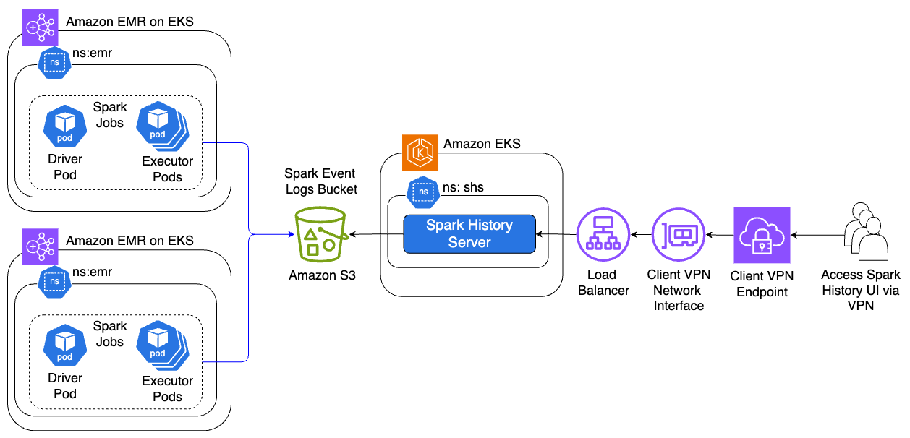

# Build a centralized observability platform for Apache Spark on Amazon EMR on EKS using external Spark History Server
This repository shows you how to build a centralized observability platform for Apache Spark based applications running on [Amazon EMR on EKS](https://docs.aws.amazon.com/emr/latest/EMR-on-EKS-DevelopmentGuide/emr-eks.html) using Spark History Server (SHS) and performance monitoring tools like [DataFlint](https://github.com/dataflint/spark). We'll demonstrate how to collect Spark events from multiple EMR on EKS clusters into a central Amazon S3 bucket, set up a dedicated Amazon EKS cluster to host the SHS, and configure secure access using [AWS Load Balancer Controller](https://kubernetes-sigs.github.io/aws-load-balancer-controller/latest/), [AWS Private Certificate Authority](https://docs.aws.amazon.com/privateca/latest/userguide/PcaWelcome.html) , [Amazon Route53](https://docs.aws.amazon.com/Route53/latest/DeveloperGuide/Welcome.html) and [AWS Client VPN](https://aws.amazon.com/vpn/client-vpn/). This solution enables teams to monitor, analyze, and troubleshoot Spark applications from multiple clusters through a single, secure interface.

This repository accompanies the AWS Big Data Blog post [Build a centralized observability platform for Apache Spark on Amazon EMR on EKS using external Spark History Server](https://aws.amazon.com/blogs/big-data/build-a-centralized-observability-platform-for-apache-spark-on-amazon-emr-on-eks-using-external-spark-history-server/). Please refer to the blog post for additional details.

## Solution Overview



This solution consists of:

- Collecting Spark events from multiple EMR on EKS clusters into a central Amazon S3 bucket
- Setting up a dedicated Amazon EKS cluster to host the Spark History Server
- Implementing DataFlint for enhanced observability capabilities
- Configuring secure access using AWS Load Balancer Controller, AWS Private Certificate Authority, Amazon Route53, and AWS Client VPN

The result is a centralized, secure, and scalable platform that enables teams to monitor, analyze, and troubleshoot Spark applications across multiple clusters through a single interface.

## Prerequisites

Before deploying this solution, ensure you have:

- Access to a valid [AWS account](https://signin.aws.amazon.com/signin)
- [AWS CLI](http://aws.amazon.com/cli) [installed](https://docs.aws.amazon.com/cli/latest/userguide/getting-started-install.html) and configured
- The following tools installed on your local machine:
  - [git](https://github.com/git-guides/install-git)
  - [docker](https://docs.docker.com/engine/install/)
  - [eksctl](https://docs.aws.amazon.com/eks/latest/userguide/eksctl.html)
  - [kubectl](https://docs.aws.amazon.com/eks/latest/userguide/install-kubectl.html)
  - [helm](https://helm.sh/docs/intro/install/)
  - [jq](https://jqlang.github.io/jq/)
  - [yq](https://mikefarah.gitbook.io/yq)
- Appropriate permissions to create AWS resources
- Familiarity with [Kubernetes](https://kubernetes.io/), [Amazon EKS](https://aws.amazon.com/eks/), and [Amazon EMR on EKS](https://docs.aws.amazon.com/emr/latest/EMR-on-EKS-DevelopmentGuide/emr-eks.html)

## Deployment Guide

### 1. Clone the Repository

```sh
git clone git@github.com:aws-samples/sample-centralized-spark-history-server-emr-on-eks.git
cd sample-centralized-spark-history-server-emr-on-eks
export REPO_DIR=$(pwd)
export AWS_REGION=<AWS_REGION>  # Replace with your preferred AWS region
```

### 2. Set Up Common Infrastructure

```sh
cd $REPO_DIR/infra
./deploy_infra.sh
```

### 3. Set Up Amazon EMR on EKS Clusters with Spark Operator

```sh
cd ${REPO_DIR}/emr-on-eks
./deploy_emr_on_eks.sh
```

### 4. Configure Apache Spark Jobs on EMR on EKS Clusters

```sh
cd $REPO_DIR/jobs
./configure_jobs.sh
```

### 5. Execute Apache Spark Jobs on EMR on EKS Clusters

You have two options to execute the Spark jobs:

#### Option 1: Using EMR Containers CLI

Repeat the following steps for each EKS cluster (datascience-cluster and analytics-cluster):

```sh
# Submit job to datascience cluster
aws emr-containers start-job-run \
  --cli-input-json file://${REPO_DIR}/jobs/start-job-run/start-job-run-request-datascience-cluster-v.json

# Submit job to analytics cluster
aws emr-containers start-job-run \
  --cli-input-json file://${REPO_DIR}/jobs/start-job-run/start-job-run-request-analytics-cluster-v.json
```

#### Option 2: Using Spark Operator

Repeat the following steps for each EKS cluster (datascience-cluster and analytics-cluster) after setting the appropriate `kubectl` context:

```sh
# Submit job to datascience cluster
kubectl apply -f ${REPO_DIR}/jobs/spark-operator/spark-history-demo-datascience-cluster-v.yaml

# Submit job to analytics cluster
kubectl apply -f ${REPO_DIR}/jobs/spark-operator/spark-history-demo-analytics-cluster-v.yaml
```

### 6. Set Up Private CA and Create Route 53 Private Hosted Zone

```sh
cd $REPO_DIR/ssl
./deploy_ssl.sh
```

### 7. Set Up Spark History Server on Amazon EKS

```sh
cd $REPO_DIR/shs
./deploy_shs.sh
```

### 8. Deploy AWS Client VPN for Secure Access

```sh
cd $REPO_DIR/vpn
./deploy_vpn.sh
```

### 9. Add Entry to Route53

```sh
cd $REPO_DIR/dns
./deploy_dns.sh
```

### 10. Add Certificate to Trusted Stores

1. For macOS:
   
   **Using Keychain Access (GUI)**
   - Open Keychain Access (Applications > Utilities > Keychain Access)
   - Select "System" keychain on the left sidebar
   - Click File > Import Items...
   - Navigate to `${REPO_DIR}/ssl/certificates` and select `ca-certificate-${AWS_ACCOUNT_ID}-${AWS_REGION}.pem`
   - Once imported, locate the certificate in the list
   - Double-click the certificate to open its properties
   - Expand the "Trust" section
   - Change "When using this certificate" to "Always Trust"
   - Close the window (you'll be prompted for your password)
   
   **Alternatively, Using Terminal (Command Line)**
   ```sh
   # Add to system keychain
   sudo security add-trusted-cert -d -r trustRoot -k /Library/Keychains/System.keychain "${REPO_DIR}/ssl/certificates/ca-certificate-${AWS_ACCOUNT_ID}-${AWS_REGION}.pem"
   ```

2. For Windows:
   
   **Using Certificate Manager (GUI)**
   - Rename the `ca-certificate-${AWS_ACCOUNT_ID}-${AWS_REGION}.pem` to `ca-certificate-${AWS_ACCOUNT_ID}-${AWS_REGION}.crt`.
   - Right-click on `ca-certificate-${AWS_ACCOUNT_ID}-${AWS_REGION}.crt` and select "Install Certificate"
   - Select "Local Machine" and click "Next" (requires admin privileges)
   - Choose "Place all certificates in the following store"
   - Click "Browse", select "Trusted Root Certification Authorities", and click "OK"
   - Click "Next" and then "Finish"

## Configuring AWS Client VPN for Secure Access

1. **Download the VPN Software**
   - Visit the [AWS Client VPN download page](https://aws.amazon.com/vpn/client-vpn-download/)
   - Download the version for your operating system

2. **Install the VPN Client**
   - Run the installer and follow the on-screen instructions

3. **Create a VPN Profile**
   - Launch the AWS VPN Client
   - Select "File" > "Manage Profiles"
   - Click "Add Profile"
   - Enter a profile name
   - Browse and select `${REPO_DIR}/vpn/client_vpn_certs/client-config.ovpn`
   - Click "Add Profile"

4. **Connect to the VPN**
   - Select your configured profile
   - Click "Connect"
   - Wait for the connection to be established

5. **Access the Spark History Server**
   - Navigate to the URL below in your browser to access SHS.

   ```
   https://spark-history-server.example.internal/
   ```

## Cleanup

To remove all resources created by this solution:

```sh
cd $REPO_DIR
./cleanup.sh
```

## Contributing

See [CONTRIBUTING](CONTRIBUTING.md#security-issue-notifications) for more information.

## License

This project is licensed under the terms specified in the [LICENSE](/LICENSE) file.

## Disclaimer

This solution deploys open-source software, including [Apache Spark](https://spark.apache.org/docs/latest/) and [Spark History Server](https://spark.apache.org/docs/latest/), in the AWS cloud. AWS makes no claims regarding security properties of any open-source software. Please evaluate all open-source software, including Apache Spark and Spark History Server, according to your organization's security best practices before implementing the solution.
